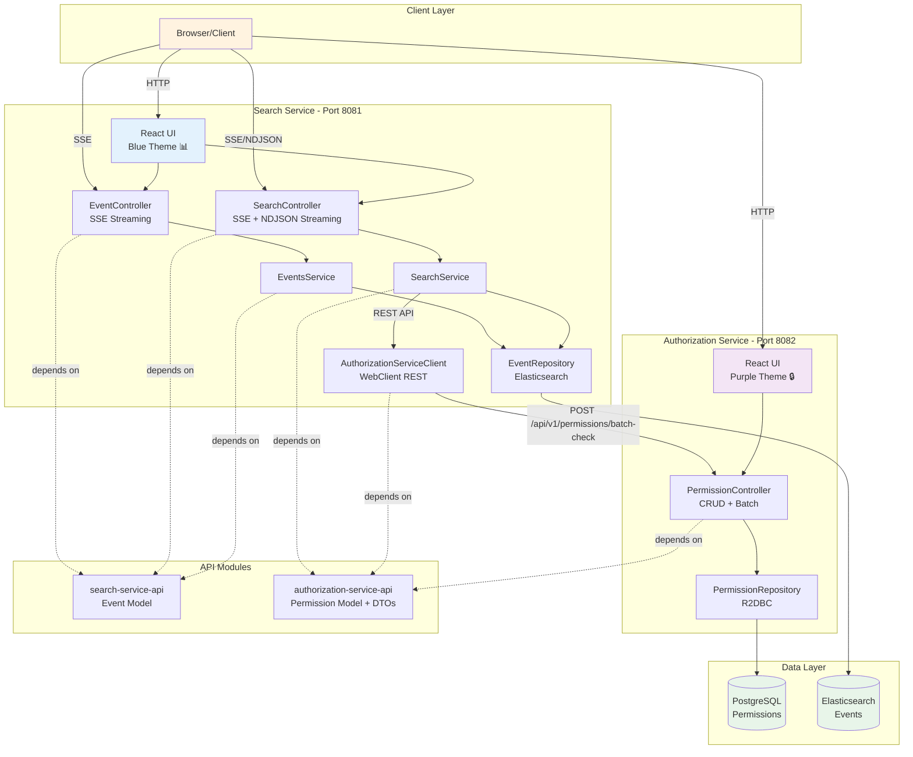

# WebFlux SSE Event Streaming Application

A microservices-based Spring WebFlux application demonstrating real-time event streaming and search with a reactive architecture. Features:
- **SSE (Server-Sent Events)** for real-time dashboard updates and search results
- **NDJSON streaming** for search results (alternative to SSE)
- Dual persistence (PostgreSQL + Elasticsearch)
- Permission-based access control
- React frontend with distinct service themes

## Architecture

### High-Level Overview

The application follows a **microservices architecture** with four Maven modules:

1. **API Modules** (Shared Contracts):
   - `search-service-api` - Event model shared across services
   - `authorization-service-api` - Permission models and DTOs

2. **Service Modules** (Running Services):
   - `search-server` (port 8081) - Event management, SSE streaming, and search
   - `authorization-server` (port 8082) - Permission management

### Architecture Diagram



### Service Communication Flow

1. **Event Creation Flow**:
   - Browser → Search Service → Elasticsearch

2. **Permission-Aware Search Flow**:
   - Browser → Search Service → Elasticsearch (get matching events)
   - Search Service → Authorization Service (check permissions via REST API)
   - Search Service → Browser (filtered results via SSE or NDJSON stream)

3. **Permission Management Flow**:
   - Browser → Authorization Service → PostgreSQL

### Technology Stack
- **Backend**: Spring Boot 3.2.0 with WebFlux (reactive web framework)
- **Databases**:
  - PostgreSQL with R2DBC (reactive database connectivity)
  - Elasticsearch 8.8.0 for full-text search
- **Frontend**: React 18 (loaded via CDN) with distinct themes per service
  - Search Service: Blue theme (📊)
  - Authorization Service: Purple theme (🔒)
- **Inter-Service Communication**: REST APIs via WebClient
- **Client Communication Protocols**:
  - **SSE (Server-Sent Events)**: Real-time event streaming and search results streaming
  - **NDJSON (Newline Delimited JSON)**: Search results streaming (alternative to SSE)
  - **JSON**: Standard REST API responses
- **Testing**: Testcontainers with PostgreSQL and Elasticsearch for integration tests

---

## Prerequisites

- Java 21
- Maven 3.6+
- Docker and Docker Compose

## Quick Start

The easiest way to run the complete application:

```bash
# Start everything (databases + all services)
./demo/start.sh

# Stop everything (or just press Ctrl+C)
./demo/stop.sh

# Run integration tests
mvn verify
```

The demo script will:
1. Start PostgreSQL and Elasticsearch in Docker
2. Wait for services to be ready
3. Start the Authorization Service (port 8082)
4. Start the Search Service (port 8081)
5. Display connection information

### Access the Application

Once started, you can access:
- **Search Service UI** (Events Dashboard): http://localhost:8081
- **Search Service API Docs**: http://localhost:8081/swagger-ui.html
- **Authorization Service UI** (Permissions Management): http://localhost:8082/permissions.html
- **Authorization Service API Docs**: http://localhost:8082/swagger-ui.html

---

## Demo Instructions

Follow these steps to see the application in action:

### 1. Start the Application
```bash
./demo/start.sh
```
Wait for all services to start (PostgreSQL, Elasticsearch, authorization-server, search-server).

### 2. Create Some Events
Open http://localhost:8081 in your browser (blue-themed Search Service).

Click "Create New Event" or navigate to http://localhost:8081/create.html

Create a few events:
- "System Deployment" - "Production deployment completed"
- "User Login" - "User user123 logged in"
- "Database Backup" - "Weekly backup completed successfully"

### 3. View Real-time Event Stream (SSE)
Go back to http://localhost:8081 to see events streaming in real-time via **Server-Sent Events (SSE)**.
The page updates automatically every 2 seconds with any new events.
Open the browser DevTools Network tab to see the `text/event-stream` connection.

### 4. Grant Permissions
Open http://localhost:8082/permissions.html (purple-themed Authorization Service).

Grant permissions to users:
- Click "+ Add Permission"
- Enter User ID: `user123`
- Enter Event IDs: `1, 2, 3` (or single ID like `1`)
- Click "Create Permission(s)"

The modal closes immediately and you'll see a success message on the main page.
The permissions table updates automatically showing which users can access which events.

### 5. Search with Permission Filtering (NDJSON)
Navigate to http://localhost:8081/search.html

- Enter a search query (e.g., "deployment")
- Enter User ID: `user123`
- Click "Search"

You'll see only events that:
1. Match your search query AND
2. The user has permission to view

Results stream in **NDJSON (Newline Delimited JSON)** format as they're found.
Open the browser DevTools Network tab to see the `application/x-ndjson` response with one JSON object per line.

### 6. Search with Permission Filtering (SSE)
Navigate to http://localhost:8081/search-sse.html

- Enter a search query (e.g., "deployment")
- Enter User ID: `user123`
- Click "Search"

This demonstrates the same permission-aware search but using **Server-Sent Events (SSE)** instead of NDJSON.
Open the browser DevTools Network tab and look at the EventStream tab to see the `text/event-stream` connection.
The SSE endpoint uses the native EventSource API, which provides automatic reconnection and is fully compatible with Chrome DevTools.

### 7. Test Permission Filtering
Try searching with a different user ID who has no permissions - you'll see no results even though events exist.

Go back to the permissions page (http://localhost:8082/permissions.html) and grant permissions to the new user, then search again.

### 8. Delete Individual Permissions
On the permissions page, click the "×" button next to any event ID badge to remove that specific permission.
The table updates immediately.

### 9. View Logs
Both services log their activities. You can see:
- API calls between services
- Permission checks
- Event creation
- Search queries

### 10. Stop the Application
```bash
./demo/stop.sh
```
Or simply press **Ctrl+C** in the terminal running demo.sh.

This stops all services and Docker containers.
