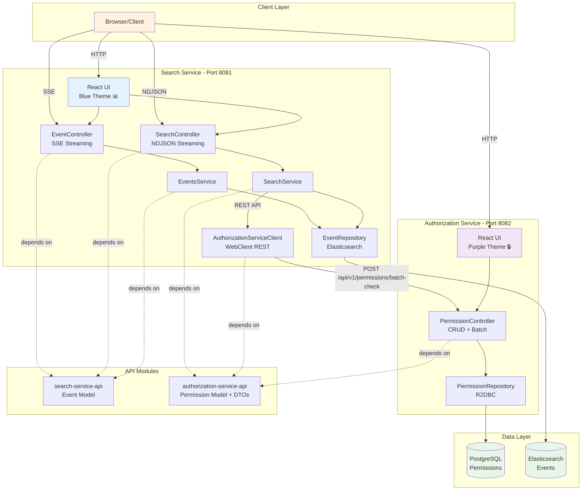

# WebFlux SSE Event Streaming Application

A microservices-based Spring WebFlux application demonstrating real-time event streaming and search with a reactive architecture. Features:
- **SSE (Server-Sent Events)** for real-time dashboard updates
- **NDJSON streaming** for search results
- Dual persistence (PostgreSQL + Elasticsearch)
- Permission-based access control
- React frontend with distinct service themes

## Architecture

### High-Level Overview

The application follows a **microservices architecture** with four Maven modules:

1. **API Modules** (Shared Contracts):
   - `search-service-api` - Event model shared across services
   - `authorization-service-api` - Permission models and DTOs

2. **Service Modules** (Running Services):
   - `search-service` (port 8081) - Event management, SSE streaming, and search
   - `authorization-service` (port 8082) - Permission management

### Architecture Diagram



### Service Communication Flow

1. **Event Creation Flow**:
   - Browser → Search Service → Elasticsearch (dual persistence)

2. **Permission-Aware Search Flow**:
   - Browser → Search Service → Elasticsearch (get matching events)
   - Search Service → Authorization Service (check permissions via REST API)
   - Search Service → Browser (filtered results via NDJSON stream)

3. **Permission Management Flow**:
   - Browser → Authorization Service → PostgreSQL

### Technology Stack
- **Backend**: Spring Boot 3.2.0 with WebFlux (reactive web framework)
- **Databases**:
  - PostgreSQL with R2DBC (reactive database connectivity) - used by authorization-service
  - Elasticsearch 8.8.0 for full-text search - used by search-service
- **Frontend**: React 18 (loaded via CDN for simplicity) with distinct themes per service
  - Search Service: Blue theme (📊)
  - Authorization Service: Purple theme (🔒)
- **Inter-Service Communication**: REST APIs via WebClient
  - search-service calls authorization-service for permission filtering
- **Client Communication Protocols**:
  - **SSE (Server-Sent Events)**: Real-time event streaming (`/api/events/stream`)
  - **NDJSON (Newline Delimited JSON)**: Search results streaming (`/api/search`)
  - **JSON**: Standard REST API responses
- **Testing**: Testcontainers 2.0.2 with PostgreSQL and Elasticsearch for integration tests
- **Reactive Streams**: Project Reactor for backpressure-aware streaming

---

## Service Documentation

### 1. search-service-api Module

**Purpose**: Shared API module containing the Event model used by search-service.

**Location**: `search-service-api/`

**Package**: `com.example.webfluxsse.search.api`

**Contents**:
- `model/Event.java` - Event entity with dual persistence annotations
  - `@Table("events")` - PostgreSQL mapping
  - `@Document(indexName = "events")` - Elasticsearch mapping

**Dependencies**:
- spring-boot-starter-webflux
- spring-boot-starter-data-r2dbc
- spring-boot-starter-data-elasticsearch

**Used By**: search-service (as dependency)

---

### 2. authorization-service-api Module

**Purpose**: Shared API module containing permission models and DTOs.

**Location**: `authorization-service-api/`

**Package**: `com.example.webfluxsse.authorization.api`

**Contents**:
- `model/UserEventPermission.java` - Permission entity with `@Table` annotation
- `dto/BatchPermissionCheckRequest.java` - Request for checking multiple permissions
- `dto/BatchPermissionCheckResponse.java` - Response with authorized event IDs
- `dto/EventIdsForUserResponse.java` - List of event IDs for a user
- `dto/PermissionCheckRequest.java` - Single permission check
- `dto/PermissionCheckResponse.java` - Single permission result

**Dependencies**:
- spring-boot-starter-webflux
- spring-boot-starter-data-r2dbc

**Used By**:
- authorization-service (as dependency)
- search-service (as dependency for DTOs)

---

### 3. search-service Module

**Purpose**: Main service for event management, real-time streaming, and search functionality.

**Location**: `search-service/`

**Port**: 8081

**Package**: `com.example.webfluxsse.search`

**Key Components**:

#### Controllers
- **EventController** (`controller/EventController.java`)
  - `GET /api/events` - Returns all events as JSON array
  - `GET /api/events/stream` - SSE endpoint for real-time streaming
  - `POST /api/events` - Create new event

- **SearchController** (`controller/SearchController.java`)
  - `GET /api/search` - NDJSON streaming search with permission filtering
  - Query params: `q` (search query)
  - Headers: `X-User-Id` (for permission filtering)

#### Services
- **EventsService** (`service/EventsService.java`)
  - Manages event CRUD operations
  - Dual persistence to Elasticsearch

- **SearchService** (`service/SearchService.java`)
  - Elasticsearch full-text search
  - Integrates with AuthorizationServiceClient for permission filtering
  - Buffers events and batch-checks permissions for efficiency

#### Client
- **AuthorizationServiceClient** (`client/AuthorizationServiceClient.java`)
  - REST client using WebClient
  - Calls authorization-service at `http://localhost:8082`
  - Methods:
    - `checkBatchPermissions(eventIds, userId)` - Batch permission check
    - `getEventIdsForUser(userId)` - Get all permitted event IDs

#### Repositories
- **EventElasticsearchRepository** (`repository/EventElasticsearchRepository.java`)
  - Reactive Elasticsearch repository
  - Custom search queries with title/description matching

#### Configuration
- `application.yml`:
  ```yaml
  server:
    port: 8081
  spring:
    elasticsearch:
      uris: http://localhost:9200
  authorization-service:
    base-url: http://localhost:8082
  ```

#### Frontend
- `static/index.html` - Event dashboard with SSE streaming (blue theme)
- `static/create.html` - Event creation form
- `static/search.html` - Search interface with permission filtering
- `static/css/` - Blue theme styling
- `static/js/` - React components

#### Database
- **Elasticsearch** - Stores and indexes events for full-text search

#### Dependencies
- search-service-api (Event model)
- authorization-service-api (DTOs for inter-service communication)
- spring-boot-starter-webflux
- spring-boot-starter-data-elasticsearch

#### Tests
- 16 integration tests
- `EventControllerIT` - Event CRUD and SSE streaming
- `StreamingSearchIT` - Search with mocked authorization service
- `DualPersistenceIT` - Elasticsearch persistence
- `SearchPocIntegrationIT` - Search proof-of-concept

---

### 4. authorization-service Module

**Purpose**: Permission management service for access control.

**Location**: `authorization-service/`

**Port**: 8082

**Package**: `com.example.webfluxsse.authorization`

**Key Components**:

#### Controllers
- **PermissionController** (`controller/PermissionController.java`)
  - `GET /api/permissions` - Get all permissions
  - `GET /api/permissions/user/{userId}` - Get user's permissions
  - `GET /api/permissions/event/{eventId}` - Get event's permissions
  - `GET /api/permissions/user/{userId}/events` - Get event IDs for user
  - `POST /api/permissions` - Grant permission (single)
  - `POST /api/permissions/bulk` - Grant permissions (multiple events)
  - `POST /api/permissions/batch-check` - Check multiple permissions (used by search-service)
  - `DELETE /api/permissions/event/{eventId}/user/{userId}` - Revoke permission

#### Repositories
- **UserEventPermissionRepository** (`repository/UserEventPermissionRepository.java`)
  - R2DBC reactive repository
  - Custom queries for permission checks
  - Methods:
    - `findByUserId(userId)` - Find all permissions for user
    - `findByEventId(eventId)` - Find all permissions for event
    - `findByEventIdAndUserId(eventId, userId)` - Check specific permission
    - `findAllByUserIdAndEventIdIn(userId, eventIds)` - Batch permission check
    - `deleteByEventIdAndUserId(eventId, userId)` - Revoke permission

#### Configuration
- `application.yml`:
  ```yaml
  server:
    port: 8082
  spring:
    r2dbc:
      url: r2dbc:postgresql://localhost:5432/eventdb
      username: postgres
      password: password
  ```

- `init.sql`:
  ```sql
  CREATE TABLE IF NOT EXISTS user_event_permissions (
      id BIGSERIAL PRIMARY KEY,
      event_id BIGINT NOT NULL,
      user_id VARCHAR(255) NOT NULL,
      UNIQUE(event_id, user_id)
  );
  ```

#### Frontend
- `static/permissions.html` - Permission management interface (purple theme)
  - Table view showing user → event mappings
  - Modal popup for adding permissions
  - Inline delete buttons for removing permissions
  - Auto-refresh on CRUD operations
- `static/css/` - Purple theme styling
- `static/js/` - React components

#### Database
- **PostgreSQL** - Stores user-event permission mappings

#### Dependencies
- authorization-service-api (UserEventPermission model and DTOs)
- spring-boot-starter-webflux
- spring-boot-starter-data-r2dbc
- r2dbc-postgresql

#### Tests
- 14 integration tests
- `PermissionControllerIT` - Full CRUD operations, batch operations, permission checks

---

## Inter-Service Communication

### Authorization Service Client (in search-service)

The search-service uses `AuthorizationServiceClient` to communicate with authorization-service via REST API:

```java
// Batch permission check (used during search)
Mono<BatchPermissionCheckResponse> checkBatchPermissions(List<Long> eventIds, String userId)
// POST http://localhost:8082/api/permissions/batch-check

// Get all event IDs for a user
Flux<Long> getEventIdsForUser(String userId)
// GET http://localhost:8082/api/permissions/user/{userId}/events
```

**Request Example**:
```json
POST http://localhost:8082/api/permissions/batch-check
Content-Type: application/json

{
  "userId": "user123",
  "eventIds": [1, 2, 3, 4, 5]
}
```

**Response Example**:
```json
{
  "userId": "user123",
  "authorizedEventIds": [1, 3, 5]
}
```

### Error Handling

- If authorization-service is unavailable, search-service returns empty results
- Errors are logged but don't crash the search operation
- Graceful degradation ensures search functionality continues

## Features

### Core Functionality
- **Real-time Event Streaming via SSE**: Server-Sent Events endpoint that streams database events every 2 seconds with deduplication
- **Event Creation**: POST API to create new events that appear immediately in the stream
- **Event Retrieval**: GET endpoint returning all events ordered by timestamp DESC
- **Dual Persistence**: Events are stored in both PostgreSQL (primary) and Elasticsearch (search index)
- **Responsive Design**: Clean, modern UI that works on different screen sizes

### Advanced Features
- **Permission-Based Access Control**: Fine-grained user-event permission system
  - Grant/revoke permissions to specific events
  - Bulk permission assignment
  - Permission filtering on search results
- **Full-Text Search via NDJSON**: Elasticsearch-powered search with permission-aware filtering
  - Case-insensitive search across event titles and descriptions
  - NDJSON (Newline Delimited JSON) streaming format for efficient data transfer
  - User-specific result filtering
- **Reactive Architecture**: Non-blocking, backpressure-aware streams throughout
- **Graceful Degradation**: Application works with PostgreSQL only if Elasticsearch is unavailable

## Prerequisites

- Java 21
- Maven 3.6+
- Docker and Docker Compose

## Quick Start

The easiest way to run the complete application with all services:

```bash
# Start everything (databases + all services)
./start.sh

# Stop everything
./stop.sh

# Run integration tests
./test.sh
```

The start script will:
1. Start PostgreSQL and Elasticsearch in Docker
2. Wait for services to be ready
3. Start the Authorization Service (port 8082)
4. Start the Search Service (port 8081)
5. Display connection information

### Access the Application

Once started, you can access:
- **Search Service UI** (Events Dashboard): http://localhost:8081
- **Search Service API Docs**: http://localhost:8081/swagger-ui.html
- **Authorization Service UI** (Permissions Management): http://localhost:8082/permissions.html
- **Authorization Service API Docs**: http://localhost:8082/swagger-ui.html

## Manual Setup

If you prefer to run components separately:

### 1. Start Databases Only
```bash
docker-compose up -d
```

### 2. Build All Modules
```bash
mvn clean install
```

### 3. Start Services

Start each service in a separate terminal:

```bash
# Terminal 1: Start Authorization Service (port 8082)
mvn -pl authorization-service spring-boot:run

# Terminal 2: Start Search Service (port 8081)
mvn -pl search-service spring-boot:run
```

### 4. Access Application
- Search Service (Events Dashboard): http://localhost:8081
- Search Service API Docs: http://localhost:8081/swagger-ui.html
- Authorization Service (Permissions): http://localhost:8082/permissions.html
- Authorization Service API Docs: http://localhost:8082/swagger-ui.html

### 5. Run Tests
```bash
# Unit tests (Surefire)
mvn test

# Integration tests with Testcontainers (Failsafe)
mvn verify
```

## API Documentation

Both services expose interactive API documentation via **Swagger UI** powered by springdoc-openapi.

### Search Service (Port 8081)

**Swagger UI**: http://localhost:8081/swagger-ui.html  
**OpenAPI Spec**: http://localhost:8081/v3/api-docs

**Key Endpoints**:
- **Frontend Pages**: Dashboard (`/`), Create (`/create.html`), Search (`/search.html`)
- **Event Management**:
  - `GET /api/v1/events` with `Accept: text/event-stream` - SSE streaming (real-time updates)
  - `GET /api/v1/events` with `Accept: application/json` - Fetch all events as JSON
  - `POST /api/v1/events` - Create new event
- **Search**: `POST /api/rpc/v1/search` - RPC-style search with request body (`{query, userId}`)

### Authorization Service (Port 8082)

**Swagger UI**: http://localhost:8082/swagger-ui.html  
**OpenAPI Spec**: http://localhost:8082/v3/api-docs

**Key Endpoints**:
- **Frontend Page**: Permissions management (`/permissions.html`)
- **Permission Management**: Full CRUD at `/api/v1/permissions/*`
- **Batch Operations**: `/api/v1/permissions/bulk`, `/api/v1/permissions/batch-check`

**Note**: Start the services using `./start.sh` to access the Swagger UI endpoints.


Each service has its own `application.yml` configuration:

### Search Service (`search-service/src/main/resources/application.yml`)
```yaml
server:
  port: 8081
spring:
  elasticsearch:
    uris: http://localhost:9200
authorization-service:
  base-url: http://localhost:8082
```

### Authorization Service (`authorization-service/src/main/resources/application.yml`)
```yaml
server:
  port: 8082
spring:
  r2dbc:
    url: r2dbc:postgresql://localhost:5432/eventdb
    username: postgres
    password: password
```

Note: Elasticsearch is optional. If not configured, the search service will work with reduced functionality.

## Testing Strategy

- **Unit Tests**: Fast, isolated tests using Surefire plugin
- **Integration Tests**: End-to-end tests using Failsafe plugin with Testcontainers
  - **search-service** (16 tests):
    - `EventControllerIT` - Event CRUD and SSE streaming tests
    - `StreamingSearchIT` - Search functionality with mocked authorization service
    - `DualPersistenceIT` - Dual PostgreSQL/Elasticsearch persistence tests
    - `SearchPocIntegrationIT` - Search proof-of-concept tests
  - **authorization-service** (14 tests):
    - `PermissionControllerIT` - Permission management API tests including batch operations
- **Database Testing**: Real PostgreSQL and Elasticsearch databases in Docker containers
- **API Testing**: WebTestClient for reactive web layer testing
- **SSE Testing**: StepVerifier for reactive stream testing
- **Mocking**: WireMock for mocking inter-service REST API calls
- **Dynamic Configuration**: DynamicPropertyRegistry for runtime test configuration
- **Total Tests**: 30 integration tests across both services


## Technologies Used

- **Java 21** - Latest LTS version
- **Spring Boot 3.2.0** - Application framework
- **Spring WebFlux** - Reactive web framework
- **Spring Data R2DBC** - Reactive database access
- **Spring Data Elasticsearch** - Reactive search integration
- **Project Reactor** - Reactive streams implementation
- **PostgreSQL 15** - Primary database
- **Elasticsearch 8.8.0** - Search engine
- **React 18** - Frontend framework
- **Testcontainers 2.0.2** - Container-based testing
- **Maven** - Build tool

## Project Structure

```
webflux-sse/
├── pom.xml                                    # Parent aggregator POM
├── search-service-api/                        # Event model API module
│   ├── pom.xml
│   └── src/main/java/com/example/webfluxsse/search/api/
│       └── model/
│           └── Event.java                     # Shared Event model
│
├── authorization-service-api/                 # Authorization API module
│   ├── pom.xml
│   └── src/main/java/com/example/webfluxsse/authorization/api/
│       ├── model/
│       │   └── UserEventPermission.java       # Shared permission model
│       └── dto/                               # Shared DTOs
│           ├── BatchPermissionCheckRequest.java
│           ├── BatchPermissionCheckResponse.java
│           ├── EventIdsForUserResponse.java
│           ├── PermissionCheckRequest.java
│           └── PermissionCheckResponse.java
│
├── search-service/                            # Search Service (Port 8081)
│   ├── pom.xml
│   └── src/
│       ├── main/
│       │   ├── java/com/example/webfluxsse/search/
│       │   │   ├── controller/
│       │   │   │   ├── EventController.java
│       │   │   │   └── SearchController.java
│       │   │   ├── service/
│       │   │   │   ├── EventsService.java
│       │   │   │   └── SearchService.java
│       │   │   ├── repository/
│       │   │   │   └── EventElasticsearchRepository.java
│       │   │   ├── client/
│       │   │   │   └── AuthorizationServiceClient.java  # REST client
│       │   │   ├── config/
│       │   │   └── SearchServiceApplication.java
│       │   └── resources/
│       │       ├── application.yml             # Port 8081 config
│       │       └── static/                     # Blue-themed UI
│       │           ├── index.html
│       │           ├── create.html
│       │           ├── search.html
│       │           ├── css/
│       │           └── js/
│       └── test/                               # 16 integration tests
│
└── authorization-service/                     # Authorization Service (Port 8082)
    ├── pom.xml
    └── src/
        ├── main/
        │   ├── java/com/example/webfluxsse/authorization/
        │   │   ├── controller/
        │   │   │   └── PermissionController.java
        │   │   ├── repository/
        │   │   │   └── UserEventPermissionRepository.java
        │   │   ├── config/
        │   │   └── AuthorizationServiceApplication.java
        │   └── resources/
        │       ├── application.yml             # Port 8082 config
        │       ├── init.sql                    # Permissions table schema
        │       └── static/                     # Purple-themed UI
        │           ├── permissions.html
        │           ├── css/
        │           └── js/
        └── test/                               # 14 integration tests
```

## Demo Instructions

Follow these steps to see the application in action:

### 1. Start the Application
```bash
./start.sh
```
Wait for all services to start (PostgreSQL, Elasticsearch, authorization-service, search-service).

### 2. Create Some Events
Open http://localhost:8081 in your browser (blue-themed Search Service).

Click "Create New Event" or navigate to http://localhost:8081/create.html

Create a few events:
- "System Deployment" - "Production deployment completed"
- "User Login" - "User user123 logged in"
- "Database Backup" - "Weekly backup completed successfully"

### 3. View Real-time Event Stream (SSE)
Go back to http://localhost:8081 to see events streaming in real-time via **Server-Sent Events (SSE)**.
The page updates automatically every 2 seconds with any new events.
Open the browser DevTools Network tab to see the `text/event-stream` connection.

### 4. Grant Permissions
Open http://localhost:8082/permissions.html (purple-themed Authorization Service).

Grant permissions to users:
- Click "+ Add Permission"
- Enter User ID: `user123`
- Enter Event IDs: `1, 2, 3` (or single ID like `1`)
- Click "Create Permission(s)"

The modal closes immediately and you'll see a success message on the main page.
The permissions table updates automatically showing which users can access which events.

### 5. Search with Permission Filtering (NDJSON)
Navigate to http://localhost:8081/search.html

- Enter a search query (e.g., "deployment")
- Enter User ID: `user123`
- Click "Search"

You'll see only events that:
1. Match your search query AND
2. The user has permission to view

Results stream in **NDJSON (Newline Delimited JSON)** format as they're found.
Open the browser DevTools Network tab to see the `application/x-ndjson` response with one JSON object per line.

### 6. Test Permission Filtering
Try searching with a different user ID who has no permissions - you'll see no results even though events exist.

Go back to the permissions page (http://localhost:8082/permissions.html) and grant permissions to the new user, then search again.

### 7. Delete Individual Permissions
On the permissions page, click the "×" button next to any event ID badge to remove that specific permission.
The table updates immediately.

### 8. View Logs
Both services log their activities. You can see:
- API calls between services
- Permission checks
- Event creation
- Search queries

### 9. Stop the Application
```bash
./stop.sh
```

This stops all services and Docker containers.